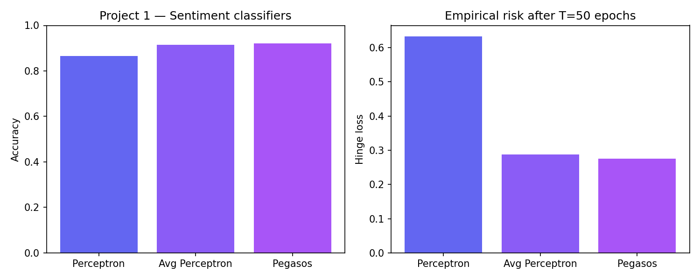
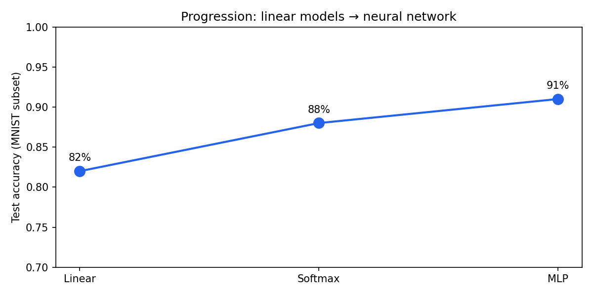

# mitx-686x-ml-progression

**MITx 6.86x — Machine Learning with Python: From Linear Models to Deep Learning**

Progressão intencional do MicroMasters SDSC: classificadores lineares com margem → visão computacional → aprendizado não supervisionado (EM / mistura gaussiana).

---

## Resultados — Project 1 (sentiment, toy dataset)

| Classificador | Accuracy | Hinge loss |
|---------------|----------|------------|
| Perceptron | **0.865** | 0.6331 |
| Average Perceptron | **0.915** | 0.2882 |
| Pegasos (λ=0.2) | **0.920** | 0.2756 |



O **Pegasos** combina SGD no hinge loss com projeção L2 — ponte direta para SVM e redes com regularização.

---

## Progressão MNIST



| Estágio | Modelo | Complexidade |
|---------|--------|--------------|
| 1 | Regressão linear / perceptron | O(d) parâmetros |
| 2 | Softmax multiclasse | softmax(Wx+b) |
| 3 | MLP 1 hidden layer | não-linearidade ReLU |

---

## Módulos

| Módulo | Tópico | Comando |
|--------|--------|---------|
| `01_sentiment` | Perceptron, Avg Perceptron, Pegasos | `python 01_sentiment/run.py` |
| `02_mnist` | Linear → MLP (subset) | `python 02_mnist/run.py` |
| `03_matrix_completion` | EM gaussiano (Netflix-style) | `python 03_matrix_completion/run.py` |

## Fundamentos

**Hinge loss:** `L(y, x; θ) = max(0, 1 − y·(θᵀx + θ₀))`

**Pegasos update:** `θ_{t+1} = (1 − ηₜλ)θₜ + ηₜ∇L`, com projeção `||θ|| ≤ 1/√λ`

**EM (matrix completion):** alternar E-step (responsabilidades) e M-step (μ, Σ) até convergência de log-likelihood.

## Setup

```bash
pip install -r requirements.txt
python docs/generate_figures.py
```

## Portfólio

- [Portfolio AI Engineer / CTO](https://portfolio-ai-cto-guaranta.netlify.app)

## Autor

**Guarantã Almeida** — [github.com/guaranta](https://github.com/guaranta)
